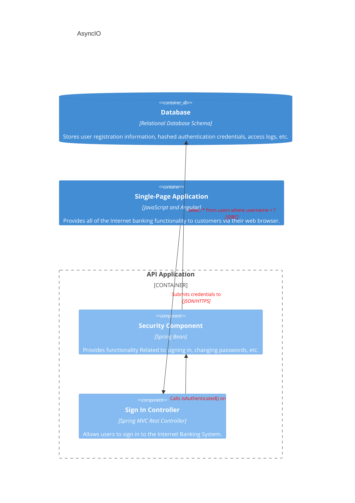

---
tags:
  - it/ProgrammingLanguages
---
[Russian Tutorial 1H](https://youtu.be/h-EFkclgCc8?si=3Rql0NN_6uZkyhpl)
[Tech With Tim](https://youtu.be/Qb9s3UiMSTA?si=cYPJATD3JQCwkPyB)

[[c4 model]]

> [!info]
> Instead of giving A+B+C we can take max(A, B, C)

| Sync            | Async          |
| --------------- | -------------- |
| Start ➡️ Finish | Start➡️Start➡️ |
| Start ➡️ Finish | Finish➡️Finish |

## Components
- Function that may pause - Async similar to [Generators](https://www.geeksforgeeks.org/python/generators-in-python/)
- In function point where to pause - Await
- Pause/Resume manager - Event loop (`asyncio.run()`)

Coroutine ➡️ <mark style="background: #BBFABBA6;">Can</mark> pause and resume
Subroutine  ➡️  Control given to subroutine. After it finishes control returns back to main thread (<mark style="background: #FF5582A6;">Can't</mark> pause and resume)
Routine 

Concurrency vs Parallelism
![[Concurrency_vs_Parallelism_better.png]]
![[Concurrency_vs_Parallelism.png]]

> Use 'await' with 'awaitable' commands
> Any function that has 'await' keyword must be declared 'async'

## Event loop

