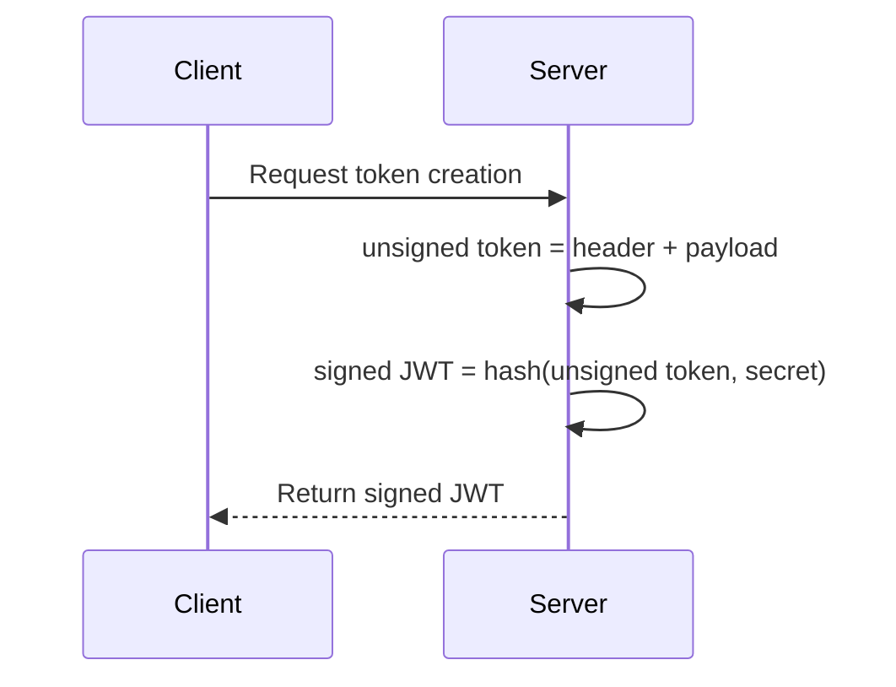

---
tags:
  - it/auth
---

[RFC 7519]

`header.payload.signature`

## Header
How to decode JWT signature

- Algorithm: HS256
- Type: JWT
## Payload
Same as JWT-claims (just an information)
- Standard
	- iss(issuer)
	- sub(subject)
	- exp(expiration time)
	- aud(audience) - reciaver
	- nbf(not before)  - ?
	- iat(issued at) 
	- jti(JWT id)
- Custom
	- userID 
	- ...

## Signature

