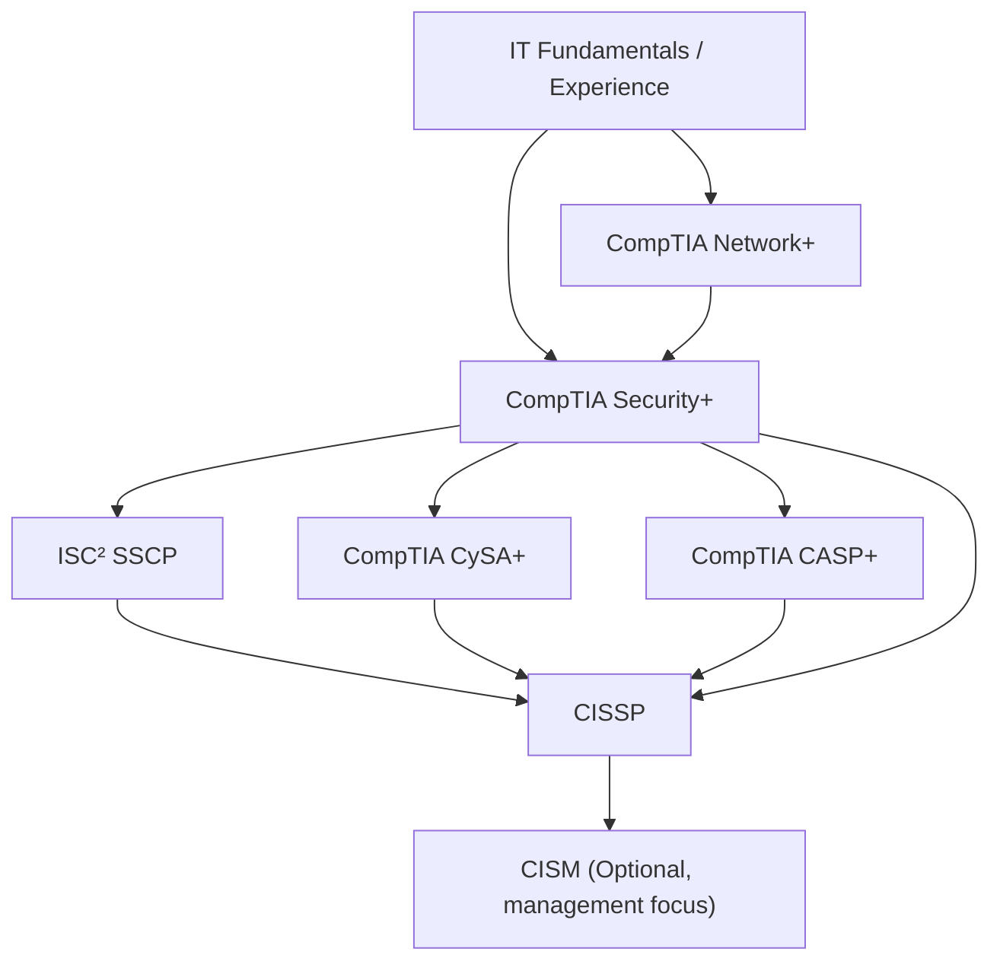

---
aliases:
title: Security Certification
draft: true
tags:
  - certifications
  - CyberSecurity
description: 481 certifications listed | July 2024
permalink: https://pauljerimy.com/security-certification-roadmap/
date: 2025-09-30
---
## Tier 1 – Fundamentals (Technical Bedrock)
- ==CompTIA Security+==
- CompTIA Network+
## Tier 2 – Mid-Level Specialization
- ==CompTIA CySA+ (Cybersecurity Analyst)==
- (ISC)² SSCP (Systems Security Certified Practitioner)
## Tier 3 – Managerial / Risk Focus (Closer to CISSP DNA)
- CompTIA CASP+ (Advanced Security Practitioner)
- Certified CISM (ISACA’s Certified Information Security Manager)

