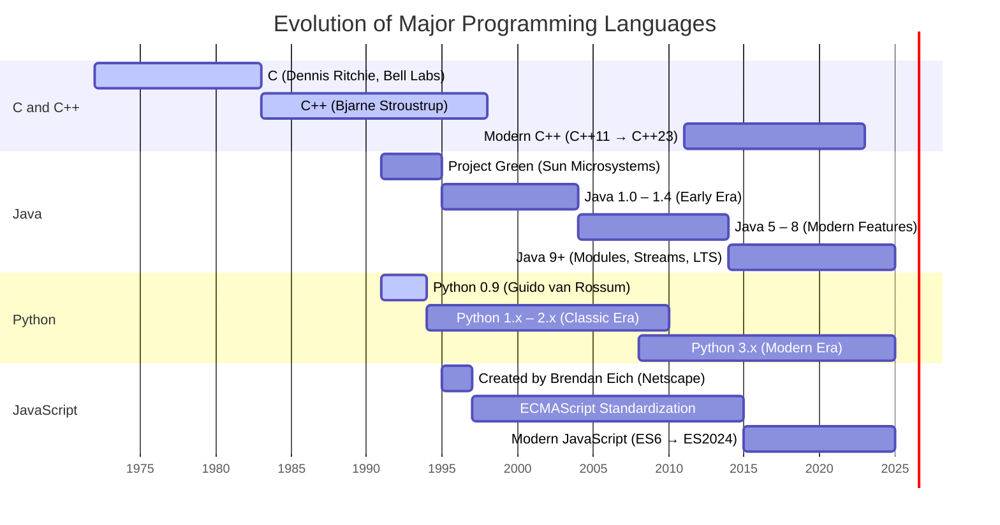

---
aliases:
title: Small History of Java
draft: false
tags:
  - java
description:
permalink:
date: 2025-10-09
---
## 🕰️ History of Java

**1991 – The Beginning**
- _Project Green_ started at Sun Microsystems by **James Gosling**, **Patrick Naughton**, and team.
- Initially aimed at embedded systems; the language was called _Oak_.

**1995 – Java 1.0 Released**
- Officially renamed **Java**.
- Introduced the slogan _“Write Once, Run Anywhere”_.
- Applets made Java popular on the web.

**1998 – Java 2 (J2SE 1.2)**
- Brought the **Collections Framework** and **Swing GUI**.
- Marked Java’s entrance into enterprise development.

**2004 – Java 5 (J2SE 5.0)**
- Introduced **Generics**, **Annotations**, **Enums**, and **Enhanced for-loop**.

**2006 – OpenJDK Released**
- Java becomes **open source** under the GPL license.

**2009 – Oracle Acquires Sun Microsystems**
- Oracle takes stewardship of Java’s future.

**2011 – Java 7**
- Added **try-with-resources**, **diamond operator**, and other syntax improvements.

**2014 – Java 8**
- Major leap: **Lambdas**, **Streams API**, **Date/Time API**, and **default methods**.

**2017 – Java 9**
- Introduced the **module system** (Project Jigsaw).

**2018 – Java 10+**
- Oracle adopts a **6-month release cycle**.

**2021 – Java 17 (LTS)**
- Long-term support version with pattern matching and sealed classes.

**2023 – Java 21 (LTS)**
- Added **virtual threads (Project Loom)** and **record patterns**.

---

**Summary:**  
From a small embedded-systems experiment to a robust enterprise and cloud ecosystem, Java’s history is a story of **portability, stability, and steady evolution** — balancing innovation with backward compatibility.

---

