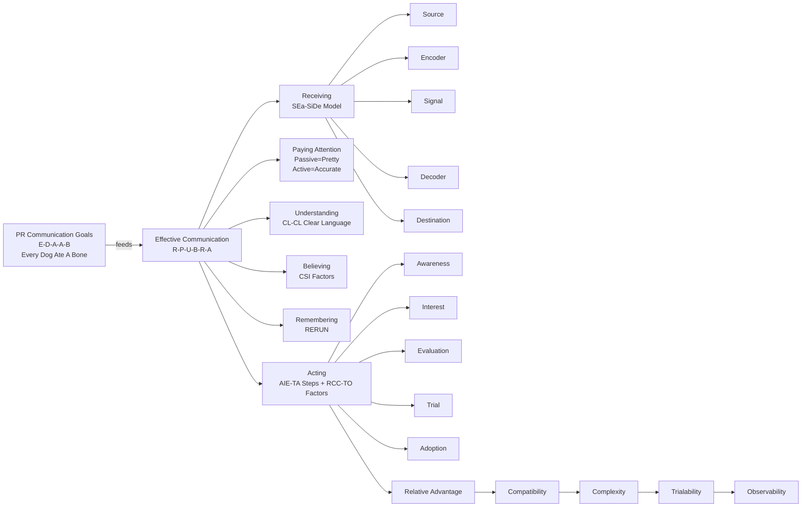

---
aliases:
title: Communication
draft: true
tags:
  - "#race"
description:
permalink:
date: 2025-11-13
---
 
Here is your **Obsidian-ready**, clean, structured note — with **Mermaid diagram**, **ASCII storyboard**, **mnemonics**, and your preferred tags.

---

# Communication in Public Relations — Memory-Optimized Note

tags: #communication #mnemonics #public_relations #study_notes #obsidian

---

## 🎯 Master Mnemonic of PR Communication Goals

**Mnemonic:** **E–D–A–A–B → “Every Dog Ate A Bone.”**

1. **Exposure**
2. **Dissemination** (accurate)
3. **Acceptance**
4. **Attitude Change**
5. **Behavior Change**

---

## 🧠 Six Components of Effective Communication

**Mnemonic:** **R–P–U–B–R–A → “Rabbits Prefer Using Big Red Apples.”**

1. Receiving
2. Paying Attention
3. Understanding
4. Believing
5. Remembering
6. Acting

---

## 📡 The Five Elements of Communication

**Mnemonic:** **S–E–S–D–D → “SEa-SiDe Destination.”**

1. Source
2. Encoder
3. Signal
4. Decoder
5. Destination

---

## 🧭 Audience Attention Mnemonic

**Passive = Pretty** → visuals, style, emotion
**Active = Accurate** → facts, detail, clarity
**Mnemonic:** **“Pretty for Passive, Accurate for Active.”**

---

## 🧼 Understanding the Message

**Mnemonic:** **CL–CL → Clear Language = Clear Listeners**
• Common language
• Literacy level
• Clarity & simplicity
• Avoid offense

---

## 🔍 Belief Factors

**Mnemonic:** **CSI**
• **C**redibility
• **S**ituation (context)
• **I**nvolvement (audience’s predisposition)

---

## 🔁 Memory Reinforcement

**Mnemonic:** **“RERUN”**
Repeat → Reinforce → Use multiple channels

---

## 🏃 Adoption of Ideas

### Five Steps

Mnemonic: **A–I–E–T–A → “AIE-TA!”**

1. Awareness
2. Interest
3. Evaluation
4. Trial
5. Adoption

### Five Factors

Mnemonic: **R–C–C–T–O → “RCC-TO (robot name)”**

1. Relative Advantage
2. Compatibility
3. Complexity
4. Trialability
5. Observability

---

# 🧱 Mermaid Diagram (Full Overview)

---

# 🎬 ASCII Storyboard (Memory Palace Characters)

1. [DOG] Every Dog Ate A Bone
   - Dog eating a PR flyer = PR goals (Exposure→Behavior)

2. [RABBIT] Rabbits Prefer Using Big Red Apples
   - Rabbit working through the 6 components: Receive → Act

3. [POSTCARD] SEA-SIDE DESTINATION
   - Postcard travels: Source → Encoder → Signal → Decoder → Destination

4. [SPLIT AUDIENCE]
   - Left side cheering memes (Passive = Pretty)
   - Right side reading textbooks (Active = Accurate)

5. [TRANSLATOR WITH “CL-CL” KEYS]
   - Unlocking understanding for the whole crowd

6. [CSI DETECTIVE]
   - Checking credibility, context, involvement

7. [TV PLAYING “RERUNS”]
   - Message repeating across multiple channels

8. [MARTIAL ARTIST SHOUTING “AIE-TA!”]
   - Awareness → Interest → Evaluation → Trial → Adoption

9. [ROBOT RCC-TO]
   - Scanning each idea for advantage, compatibility, complexity, trialability, observability

10. [WHISPERING CROWD]
   - Word-of-Mouth persuasion spreading across the hall

---

# 🎓 Quick Recall Drills

**Q:** What are the 5 PR goals?
**A:** Every Dog Ate A Bone → Exposure, Dissemination, Acceptance, Attitude, Behavior.

**Q:** 6 components of effective communication?
**A:** Rabbits Prefer Using Big Red Apples.

**Q:** Communication model?
**A:** SEa-SiDe Destination.

**Q:** Adoption steps?
**A:** AIE-TA.

**Q:** Adoption factors?
**A:** Robot RCC-TO.

---

If you want, I can add:
• a **peg-system mapping (00–99)** for all concepts
• an **interactive spaced-repetition table**
• a **visual memory palace floorplan**
